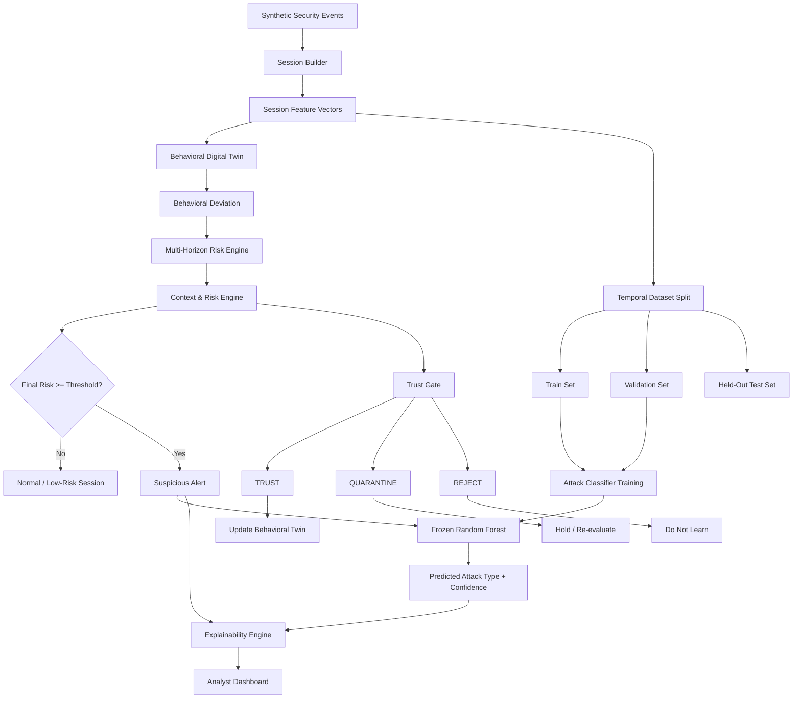

# SentinelTwin

**Adaptive Behavioral Digital Twin for Multi-Horizon Cyber Threat Detection**

SentinelTwin is a behavioral cybersecurity system that builds user-specific digital twins of normal activity and detects suspicious deviations across multiple time horizons.

Instead of relying only on static attack signatures or a single anomaly score, SentinelTwin models how individual users normally behave, evaluates how current activity differs from that baseline, tracks whether suspicious behavior persists over time, incorporates contextual security signals, and produces a final risk score.

High-risk sessions are subsequently passed to a supervised attack classifier to estimate the most likely attack type.

The system also implements **trust-gated online adaptation**, allowing behavioral profiles to evolve without blindly learning every new observation.

---

## 🚀 Live Prototype

**[Open SentinelTwin Dashboard](https://sentineltwin.streamlit.app/)**

---

## Table of Contents

- [Problem](#problem)
- [Core Idea](#core-idea)
- [Key Features](#key-features)
- [System Architecture](#system-architecture)
- [How SentinelTwin Works](#how-sentineltwin-works)
- [Attack Scenarios](#attack-scenarios)
- [Dataset and Experimental Setup](#dataset-and-experimental-setup)
- [Train / Validation / Test Strategy](#train--validation--test-strategy)
- [Attack Classification](#attack-classification)
- [Trust-Gated Adaptation](#trust-gated-adaptation)
- [Explainability](#explainability)
- [Results](#results)
- [Project Structure](#project-structure)
- [File-by-File Implementation](#file-by-file-implementation)
- [Dashboard](#dashboard)
- [Installation](#installation)
- [Running the Project](#running-the-project)
- [Design Decisions](#design-decisions)
- [Limitations](#limitations)
- [Future Work](#future-work)
- [Tech Stack](#tech-stack)

---

# Problem

Traditional security monitoring often relies on predefined rules, static thresholds, known attack signatures, or population-level models.

However, legitimate behavior varies significantly between users.

For example:

- a database administrator accessing multiple servers may be normal;
- the same behavior from an HR employee may be unusual;
- a 200 MB download may be normal for one user but highly abnormal for another;
- a single unusual session may be harmless, while a gradual deviation across several days may indicate compromise.

This creates three major problems:

1. **Static thresholds ignore individual behavioral differences.**
2. **Single-session anomaly detection can miss gradual attacks.**
3. **Continuously adapting models can accidentally learn malicious behavior as normal.**

SentinelTwin was designed around these problems.

---

# Core Idea

For each user, SentinelTwin maintains a behavioral representation of normal activity — a **behavioral digital twin**.

Each new session is compared with that user's historical baseline.

The system asks:

> How unusual is this session for this specific user?

It then asks:

> Is the abnormal behavior isolated, persistent, or increasing over time?

Finally:

> Does the security context make the anomaly more concerning?

The resulting architecture separates four concerns:

- **Detection** — is this session suspicious?
- **Temporal reasoning** — is the behavior persistent or evolving?
- **Classification** — what known attack pattern does it resemble?
- **Adaptation** — should this observation be allowed to change the user's behavioral baseline?

---

# Key Features

### Personalized Behavioral Digital Twins

SentinelTwin learns entity-specific baselines rather than applying identical thresholds to every user.

Behavioral features include:

- session duration;
- login/activity time;
- failed-login rate;
- number of accessed resources;
- device usage;
- location usage;
- data transfer;
- privileged activity;
- event volume.

---

### Multi-Horizon Risk Analysis

Suspicious behavior is evaluated across multiple temporal horizons rather than treating every session independently.

The system calculates:

- immediate risk;
- short-term risk;
- medium-term risk;
- long-term risk;
- persistence risk;
- trend risk;
- combined multi-horizon risk.

This helps detect gradual attacks such as low-and-slow data exfiltration and insider behavioral drift.

---

### Context-Aware Risk Fusion

Behavioral anomalies are combined with contextual security evidence.

This prevents the system from treating every deviation as equally dangerous.

The resulting signals are fused into a final risk score and severity level.

---

### Attack Classification

Sessions exceeding the risk threshold are passed to a trained Random Forest classifier.

The classifier estimates the most likely attack category and provides a classification confidence score.

Detection and classification are deliberately kept separate.

A session can therefore remain suspicious even if it does not cleanly match one of the known attack classes.

---

### Trust-Gated Adaptation

SentinelTwin does not automatically learn from every observed session.

Each session receives one of three adaptation decisions:

- `TRUST`
- `QUARANTINE`
- `REJECT`

Only trusted observations can immediately contribute to the behavioral baseline.

This reduces the risk of **baseline poisoning**, where malicious activity gradually becomes incorporated into the definition of normal behavior.

---

### Quarantine Recovery

Uncertain sessions are not immediately trusted or permanently discarded.

They may be quarantined and later reconsidered as additional evidence becomes available.

This allows the behavioral twin to adapt to legitimate behavioral changes while remaining conservative around suspicious activity.

---

### Deterministic Explainability

Alert explanations are generated directly from the detector's calculated signals.

For example:

- unusual login time;
- abnormal data transfer;
- unusual resource access;
- abnormal device usage;
- persistent deviation;
- contextual risk amplification.

The explanation layer does not rely on free-text LLM generation.

---

### Analyst Dashboard

A dark-mode security dashboard presents:

- system overview;
- risk metrics;
- severity distribution;
- ranked alerts;
- predicted attack types;
- classifier confidence;
- behavioral evidence;
- alert explanations.

---

# System Architecture



---

# How SentinelTwin Works

## 1. Generate security activity

The project begins with synthetic enterprise activity representing multiple users with different:

- roles;
- locations;
- devices;
- working hours;
- resource-access patterns;
- typical data-transfer behavior.

Both ordinary behavior and unusual-but-legitimate behavior are generated.

Attack scenarios are then injected into the event stream.

Ground-truth columns such as `is_attack` and `attack_type` exist **only for experimental evaluation**.

They are not detector features.

---

## 2. Convert events into sessions

Raw event logs are aggregated into session-level feature vectors.

Instead of reasoning over individual log entries, SentinelTwin evaluates behavioral sessions.

Example session features include:

```text
event_count
duration_minutes
failed_login_rate
unique_locations
unique_devices
unique_resources
total_data_mb
privileged_actions
start_hour
```

This produces a compact behavioral representation of each user session.

---

## 3. Build behavioral digital twins

Historical sessions are used to estimate normal behavior for each user.

SentinelTwin supports different baseline sources depending on available history:

- `personal` — sufficient user-specific history exists;
- `hybrid` — personal and broader behavioral information are combined;
- `cold_start` — insufficient user history exists.

Each incoming session is compared against its current baseline.

---

## 4. Calculate feature-level deviations

SentinelTwin measures how far the current session differs from expected behavior.

Examples include:

```text
start_hour_deviation
duration_minutes_deviation
failed_login_rate_deviation
unique_locations_deviation
unique_devices_deviation
unique_resources_deviation
total_data_mb_deviation
privileged_actions_deviation
```

These are combined into an overall behavioral deviation score.

Keeping feature-level deviations also allows the explainability engine to identify *why* a session was considered unusual.

---

## 5. Evaluate multiple time horizons

A single anomalous session does not tell the entire story.

SentinelTwin therefore examines recent behavioral history and calculates risk across different horizons.

Conceptually:

```text
Current session
      ↓
Immediate Risk

Recent sessions
      ↓
Short-Term Risk

Broader recent history
      ↓
Medium-Term Risk

Longer behavioral evolution
      ↓
Long-Term Risk
```

Persistence and trend information are also considered.

This is especially useful for attacks designed to remain individually subtle while becoming suspicious cumulatively.

---

## 6. Add contextual risk

Behavioral abnormality alone does not necessarily indicate malicious activity.

A legitimate business trip, replacement laptop, unusual work schedule, or temporary project may produce behavioral deviations.

The context engine combines behavioral and temporal evidence with security-sensitive context.

It produces:

```text
context_risk
final_risk
severity
```

Severity levels include:

```text
LOW
GUARDED
MEDIUM
HIGH
CRITICAL
```

---

## 7. Trigger suspicious alerts

The current risk threshold is:

```text
45.0
```

Therefore:

```text
final_risk < 45
    → no high-risk alert

final_risk >= 45
    → suspicious session
```

The threshold determines **whether the system alerts**.

It does not determine the attack type.

---

## 8. Classify suspicious sessions

Only suspicious sessions are sent to the attack classifier.

The classifier returns:

```text
predicted_attack_type
classification_confidence
```

This produces two separate pieces of information:

```text
Final Risk
→ How concerning is the behavior?

Classification Confidence
→ How strongly does the classifier favor its predicted attack label?
```

The classifier enriches the alert rather than replacing behavioral detection.

---

## 9. Explain the alert

The explainability engine examines the strongest contributing signals.

An alert may therefore contain:

```text
Risk: 84.0
Severity: CRITICAL

Predicted Attack:
low_slow_exfiltration

Why this alert:
- Data transfer strongly deviates from the user's baseline.
- Login time strongly deviates from expected behavior.
- Resource access is unusual for this user.
- Abnormal behavior persists across recent sessions.
- Contextual evidence increases the final severity.
```

---

## 10. Decide whether the twin may learn

Finally, the adaptation gate determines whether the observation should influence future behavioral baselines.

```text
                 Session
                    │
                    ▼
              Trust Decision
                    │
        ┌───────────┼───────────┐
        ▼           ▼           ▼
      TRUST     QUARANTINE    REJECT
        │           │           │
        ▼           ▼           ▼
      Learn      Hold /       Never
                 Review       Learn
```

This is the mechanism that allows the system to remain adaptive without blindly incorporating suspicious behavior.

---

# Attack Scenarios

The synthetic dataset currently contains seven attack categories.

## Brute Force

Repeated authentication failures are generated from unusual infrastructure and often outside normal working hours.

Primary indicators include:

- high failed-login rate;
- unusual login time;
- unknown device;
- unusual location;
- abnormal event volume.

---

## Credential Stuffing

Shared attacker infrastructure attempts authentication against multiple user accounts.

This represents account-targeting behavior distributed across several identities.

---

## Impossible Travel

The same user appears in geographically distant locations within an unrealistic time interval.

This introduces abnormal location and device behavior.

---

## Device Spoofing

Activity occurs using previously unseen or suspicious device identities.

This tests the ability of the behavioral model to distinguish legitimate device changes from malicious device anomalies.

---

## Lateral Movement

A compromised account accesses an unusual sequence of enterprise resources.

Example sequence:

```text
email
   ↓
admin_console
   ↓
file_server
   ↓
database
   ↓
credential_store
   ↓
dev_server
```

This creates abnormal resource-access and privileged-action patterns.

---

## Low-and-Slow Exfiltration

Data transfer gradually increases across several days.

Individual sessions are designed to be only moderately unusual.

The cumulative behavior is more suspicious than any single observation.

This attack specifically tests the multi-horizon risk engine.

---

## Insider Drift

A user's activity gradually shifts toward unusual resources, working hours, and data-access behavior.

Like low-and-slow exfiltration, the attack is intended to evolve over time rather than appear as one extreme anomaly.

---

# Hard Benign Cases

A useful anomaly detector should not be trained on a world where every unusual action is malicious.

The generator therefore includes unusual but legitimate behavior such as:

- late-night work;
- international business travel;
- replacement devices;
- legitimate large downloads;
- forgotten-password attempts;
- temporary cross-project access.

These act as **hard negatives**.

Their purpose is to make the detection problem less trivial and expose false positives caused by legitimate behavioral change.

---

# Dataset and Experimental Setup

The current experiment simulates:

```text
Users:             80
Behavior history:  45 days
```

A typical generated run contains approximately:

```text
47,000+ security events
3,000+ behavioral sessions
```

Exact counts vary depending on the generated attack campaigns and legitimate behavioral changes.

The dataset is synthetic and is intended for prototype validation rather than as evidence of production cybersecurity performance.

---

# Train / Validation / Test Strategy

SentinelTwin uses a **chronological 70/10/20 split**.

```text
Past                                      Future
│                                             │
├─────────────── 70% ───────────────┤
│               TRAIN               │
│                                   │
└───────────────────────────────────┘

                                    ├─ 10% ─┤
                                    │  VAL   │

                                             ├──── 20% ────┤
                                             │    TEST     │
```

No random shuffling is used.

The chronological split better reflects deployment conditions:

> the system learns from the past and is evaluated on future activity.

---

## Train Set

Used to train the supervised attack classifier.

Current run:

```text
Sessions:        2,105
Normal:          1,911
Attack:            194
Attack rate:      9.22%
```

---

## Validation Set

Used for model/configuration selection.

Current run:

```text
Sessions:          329
Normal:            299
Attack:             30
Attack rate:       9.12%
```

The validation period does not contain every attack category in every generated run.

Metrics therefore explicitly account for labels present in the validation data rather than treating absent classes as failed predictions.

---

## Held-Out Test Set

Used only for final evaluation.

Current run:

```text
Sessions:          621
Normal:            537
Attack:             84
Attack rate:      13.53%
```

The test period represents the future held-out portion of the generated timeline.

---

# Attack Classification

The attack classifier uses a Random Forest model.

Input features include:

```text
start_hour
event_count
duration_minutes
failed_login_rate
unique_locations
unique_devices
unique_resources
total_data_mb
privileged_actions
```

Several candidate configurations are evaluated on the validation period.

Example candidates:

```python
{"n_estimators": 150, "max_depth": 8, "min_samples_leaf": 2}

{"n_estimators": 250, "max_depth": 12, "min_samples_leaf": 2}

{"n_estimators": 300, "max_depth": None, "min_samples_leaf": 1}
```

The selected model is frozen and saved using `joblib`.

Current selected configuration:

```python
{
    "n_estimators": 300,
    "max_depth": None,
    "min_samples_leaf": 1
}
```

The model payload also stores the feature list and configuration so inference uses the same feature specification as training.

---

# Trust-Gated Adaptation

A continuously adaptive detector creates a security problem:

> What happens if malicious behavior is used to update the baseline?

Consider gradual exfiltration:

```text
Normal baseline: 15 MB

Day 1: 22 MB
Day 2: 30 MB
Day 3: 38 MB
Day 4: 50 MB
Day 5: 65 MB
```

If every observation were immediately learned, the baseline could gradually move toward the attack.

SentinelTwin therefore applies trust-gated adaptation.

---

## TRUST

The session is sufficiently safe to contribute to the behavioral twin.

```text
Low-risk observation
       ↓
     TRUST
       ↓
Update baseline
```

---

## QUARANTINE

The session is uncertain.

```text
Ambiguous observation
        ↓
    QUARANTINE
        ↓
Do not learn immediately
```

This state is useful for behavior that could represent either legitimate drift or compromise.

---

## REJECT

The session is sufficiently suspicious that it must not update the twin.

```text
High-risk observation
       ↓
     REJECT
       ↓
No baseline update
```

---

## Quarantine Recovery

The online pipeline can reconsider quarantined observations.

In the current online experiment:

```text
Sessions released from quarantine: 167
Normal sessions released:          167
Attack sessions released:            0
```

This allows legitimate behavior to eventually contribute to adaptation without immediately trusting ambiguous observations.

---

## Adaptation Safety

Current online experiment:

```text
Sessions learned:             2,208
Attack sessions learned:          0
Observed baseline contamination: 0.000%
```

This result should be interpreted specifically as:

> No ground-truth attack session entered the trusted adaptive baseline during this synthetic experiment.

It does **not** establish that baseline poisoning is impossible in arbitrary real-world conditions.

---

# Explainability

SentinelTwin explanations are grounded in calculated system signals.

The explanation engine maps internal features to analyst-readable reasons.

| Signal | Interpretation |
|---|---|
| `start_hour_deviation` | unusual activity time |
| `duration_minutes_deviation` | unusual session duration |
| `failed_login_rate_deviation` | abnormal authentication failures |
| `unique_locations_deviation` | unusual location usage |
| `unique_devices_deviation` | unusual device usage |
| `unique_resources_deviation` | unusual resource access |
| `total_data_mb_deviation` | abnormal data transfer |
| `privileged_actions_deviation` | unusual privileged activity |
| `persistence_risk` | anomaly persists across recent history |
| `context_risk` | contextual evidence amplifies concern |

Example:

```text
User: user_027
Risk: 84.0
Severity: CRITICAL
Predicted attack: low_slow_exfiltration

Why this alert:
- Data transfer strongly deviates from the user's behavioral baseline.
- Login time strongly deviates from expected behavior.
- Resource access is unusual for the user.
- Session duration differs significantly from historical behavior.
- Abnormal behavior persists across multiple recent sessions.
- Contextual indicators increase the severity.
```

---

# Results

## Held-Out Binary Detection

Final evaluation is performed on the chronological held-out test period.

```text
Test sessions:    621
Attack sessions:   84
Normal sessions:  537
```

Confusion matrix:

```text
True Negatives:   525
False Positives:   12
False Negatives:    1
True Positives:    83
```

### Detection Metrics

| Metric | Result |
|---|---:|
| Precision | **87.4%** |
| Recall | **98.8%** |
| F1 Score | **92.7%** |
| False Positive Rate | **2.24%** |

Of the 84 attack sessions in the held-out test period, SentinelTwin detected 83.

---

## Attack-Wise Detection

| Attack Type | Test Sessions | Detected | Recall |
|---|---:|---:|---:|
| Brute Force | 10 | 10 | 100% |
| Credential Stuffing | 24 | 24 | 100% |
| Device Spoofing | 10 | 10 | 100% |
| Impossible Travel | 10 | 10 | 100% |
| Insider Drift | 6 | 6 | 100% |
| Lateral Movement | 10 | 10 | 100% |
| Low-and-Slow Exfiltration | 14 | 13 | 92.9% |

Low-and-slow exfiltration was the most difficult attack category in the current held-out experiment.

---

# End-to-End Attack Identification

The final system combines:

```text
Behavioral Detection
        +
Multi-Horizon Risk
        +
Contextual Risk
        +
Attack Classification
```

Held-out attack-identification performance:

```text
Macro-F1: 0.971
```

Selected class-level results:

| Attack Type | Precision | Recall | F1 |
|---|---:|---:|---:|
| Brute Force | 1.00 | 1.00 | 1.00 |
| Credential Stuffing | 1.00 | 1.00 | 1.00 |
| Device Spoofing | 1.00 | 1.00 | 1.00 |
| Impossible Travel | 1.00 | 1.00 | 1.00 |
| Insider Drift | 0.86 | 1.00 | 0.92 |
| Lateral Movement | 1.00 | 1.00 | 1.00 |
| Low-and-Slow Exfiltration | 0.92 | 0.79 | 0.85 |

All results above are from a **synthetic held-out test period** and should be interpreted as prototype-level experimental results.

---

# Offline vs Online Evaluation

SentinelTwin includes two different experiments.

They should not be interpreted as interchangeable.

## Held-Out System Evaluation

`system_evaluation.py` evaluates the frozen detection system on the held-out test period.

Current result:

```text
Precision: 0.874
Recall:    0.988
F1:        0.927
FPR:       0.022
```

This is the primary detection benchmark.

---

## Online Adaptation Evaluation

`online_pipeline.py` evaluates sequential adaptation.

Current result:

```text
Precision: 0.425
Recall:    0.990
F1:        0.595
```

The online policy is deliberately conservative and currently produces more false positives while maintaining very high attack recall.

Its primary purpose is to study:

```text
sequential detection
+
safe adaptation
+
baseline contamination
```

rather than maximize the frozen detector's benchmark score.

Improving online precision is therefore an important future direction.

---

# Project Structure

```text
sentineltwin/
│
├── data/
│   ├── raw/
│   │   └── security_events.csv
│   │
│   ├── processed/
│   │   ├── sessions.csv
│   │   ├── behavioral_sessions.csv
│   │   ├── risk_sessions.csv
│   │   ├── context_sessions.csv
│   │   ├── trusted_sessions.csv
│   │   └── online_sessions.csv
│   │
│   ├── splits/
│   │   ├── train.csv
│   │   ├── validation.csv
│   │   └── test.csv
│   │
│   └── results/
│       ├── test_classification.csv
│       └── system_test_results.csv
│
├── models/
│   └── attack_classifier.joblib
│
├── src/
│   ├── generator.py
│   ├── sessions.py
│   ├── behavioral_twin.py
│   ├── multi_horizon.py
│   ├── context_engine.py
│   ├── trust_gate.py
│   ├── online_pipeline.py
│   ├── temporal_split.py
│   ├── attack_classifier.py
│   ├── final_test.py
│   ├── inference.py
│   ├── system_evaluation.py
│   ├── explainability.py
│   ├── pipeline.py
│   └── dashboard.py
│
├── requirements.txt
└── README.md
```

---

# File-by-File Implementation

This section describes the responsibility of each major module and the functions/classes a developer should understand before modifying SentinelTwin.

---

## `generator.py`

### Responsibility

Creates the synthetic security-event dataset used by the prototype.

It models:

- enterprise users;
- roles;
- normal schedules;
- devices;
- locations;
- resources;
- commands;
- legitimate behavioral changes;
- cyberattack campaigns.

### Main Class

```python
SecurityLogGenerator
```

Owns the synthetic users and generated event stream.

### Important Methods

#### `_create_users()`

Creates user profiles containing:

- role;
- home location;
- expected start time;
- normal session duration;
- primary and secondary devices;
- typical data-transfer volume.

#### `_append_event()`

Central event-construction method.

Creates standardized event records containing fields such as:

```text
timestamp
session_id
user_id
role
ip_address
location
device_id
resource
command
success
data_mb
privileged
attack_type
is_attack
```

`attack_type` and `is_attack` are ground truth and are not intended as detector features.

#### `_generate_normal_session()`

Generates ordinary role-consistent user activity.

#### `generate_normal_history()`

Creates historical normal behavior across the configured simulation period.

#### `inject_legitimate_behavior_changes()`

Generates difficult benign anomalies including:

- late work;
- business travel;
- new devices;
- large downloads;
- failed passwords;
- temporary project access.

#### Attack Injection Methods

```python
inject_brute_force()
inject_credential_stuffing()
inject_impossible_travel()
inject_device_spoofing()
inject_lateral_movement()
inject_low_slow_exfiltration()
inject_insider_drift()
```

Each creates a different attack pattern.

#### `generate()`

Coordinates normal history, benign behavioral changes, and attack injection before returning the complete chronological event DataFrame.

---

## `sessions.py`

### Responsibility

Converts raw security events into session-level behavioral features.

Raw logs are too granular for the main behavioral detector.

This module transforms:

```text
many event records
        ↓
one behavioral session
```

### Main Operations

Events are grouped using `session_id`.

Features are calculated for each session, including:

```text
event_count
duration_minutes
failed_login_rate
unique_locations
unique_devices
unique_resources
total_data_mb
privileged_actions
start_hour
```

The resulting `sessions.csv` becomes the primary feature dataset used by downstream modules.

---

## `behavioral_twin.py`

### Responsibility

Builds personalized behavioral baselines and measures deviation from expected user behavior.

### Core Idea

For a session feature \(x\), SentinelTwin conceptually measures deviation relative to a historical center and scale:

```text
deviation ≈ |current - expected| / normal_variability
```

This makes deviation user-specific rather than relying on a global threshold.

### Baseline Sources

```text
personal
hybrid
cold_start
```

A personal baseline is preferred when enough user history exists.

Hybrid and cold-start behavior provide fallback mechanisms for users with limited history.

### Outputs

Feature-level deviations and an overall behavioral deviation score are added to each session.

Examples:

```text
start_hour_deviation
total_data_mb_deviation
unique_resources_deviation
duration_minutes_deviation
behavioral_deviation
```

These outputs feed both risk scoring and explainability.

---

## `multi_horizon.py`

### Responsibility

Adds temporal memory to the detector.

Instead of asking only:

> Is the current session abnormal?

it also asks:

> Has abnormal behavior persisted or changed across recent sessions?

### Main Outputs

```text
immediate_risk
short_term_risk
medium_term_risk
long_term_risk
persistence_risk
trend_risk
multi_horizon_risk
```

This module is particularly important for:

- low-and-slow exfiltration;
- insider drift;
- repeated suspicious behavior.

---

## `context_engine.py`

### Responsibility

Combines behavioral, temporal, and contextual security evidence into the final risk assessment.

Conceptually:

```text
Behavioral Risk
      +
Temporal Risk
      +
Contextual Evidence
      ↓
Final Risk
```

### Main Outputs

```text
context_risk
final_risk
severity
```

Severity is mapped into:

```text
LOW
GUARDED
MEDIUM
HIGH
CRITICAL
```

This module determines the primary risk score used for alerting.

---

## `temporal_split.py`

### Responsibility

Creates the chronological train/validation/test datasets.

### Strategy

```text
70% Train
10% Validation
20% Test
```

Sessions are first ordered chronologically.

No random shuffling is performed.

This reduces temporal leakage and more closely represents learning from historical activity and evaluating on future sessions.

Outputs are stored under:

```text
data/splits/
```

---

## `attack_classifier.py`

### Responsibility

Trains the supervised attack-type classifier.

### Model

```text
Random Forest
```

### Training Process

1. Load training sessions.
2. Select behavioral session features.
3. Train several candidate Random Forest configurations.
4. Evaluate them on validation data.
5. Compare validation Macro-F1.
6. Select the best configuration.
7. Save the frozen model.

### Saved Payload

The `joblib` artifact contains:

```text
model
features
config
```

Saving the feature specification alongside the model ensures inference uses the same input structure as training.

---

## `final_test.py`

### Responsibility

Evaluates the frozen attack classifier against the held-out test split.

It reports:

- accuracy;
- Macro-F1;
- per-class precision;
- per-class recall;
- per-class F1;
- confusion matrix.

Predictions are saved for later inspection.

This evaluates the classifier itself, separately from the complete risk-detection pipeline.

---

## `inference.py`

### Responsibility

Connects SentinelTwin's risk detector to the trained attack classifier.

### Main Class

```python
SentinelTwinInference
```

### `__init__()`

Loads:

```text
attack_classifier.joblib
```

and restores:

- trained model;
- required features;
- selected configuration.

### `classify_session()`

Classifies one suspicious session and returns:

```text
predicted_attack_type
classification_confidence
```

### `classify_alerts()`

Processes a DataFrame of scored sessions.

Only sessions satisfying:

```python
final_risk >= 45
```

are passed to the classifier.

Lower-risk sessions remain `normal` by default.

This keeps detection and classification separate.

---

## `trust_gate.py`

### Responsibility

Controls whether observations are safe enough to update the behavioral twin.

### Decisions

```text
TRUST
QUARANTINE
REJECT
```

### Why It Exists

Without gating:

```text
attack
  ↓
learn attack
  ↓
baseline moves
  ↓
future attack looks more normal
```

The trust gate attempts to prevent this feedback loop.

Trusted sessions can update the baseline.

Rejected sessions cannot.

Quarantined sessions remain temporarily excluded from adaptation.

---

## `online_pipeline.py`

### Responsibility

Simulates sequential adaptive operation.

Sessions are processed chronologically one at a time.

Conceptually:

```text
Session t
   ↓
Get current baseline
   ↓
Measure deviation
   ↓
Calculate risk
   ↓
Trust decision
   ↓
Potentially update baseline
   ↓
Session t + 1
```

This is different from scoring an entire dataset using a fixed baseline.

### Quarantine Recovery

The online pipeline also supports reconsidering uncertain observations.

This allows legitimate behavioral drift to eventually enter the baseline.

### Primary Evaluation Goals

The online experiment measures:

- attack recall;
- false positives;
- trust decisions;
- number of sessions learned;
- attacks accidentally learned;
- baseline contamination.

---

## `system_evaluation.py`

### Responsibility

Produces the final held-out end-to-end system evaluation.

It matches scored sessions against the untouched test split.

### Binary Detection

Evaluates:

```text
attack
vs
normal
```

using the final risk threshold.

Reports:

```text
precision
recall
F1
false-positive rate
confusion matrix
```

### Attack-Wise Detection

Reports detection recall independently for every attack category.

### End-to-End Identification

Evaluates:

```text
Detection
+
Attack Classification
```

and reports the final multiclass Macro-F1.

This file contains the project's primary benchmark results.

---

## `explainability.py`

### Responsibility

Transforms numerical detector evidence into analyst-readable explanations.

### Explanation Sources

The engine examines:

- feature-level behavioral deviations;
- persistence;
- temporal behavior;
- contextual risk.

It ranks strong contributors and converts them into statements such as:

```text
Data transfer strongly deviates from the user's behavioral baseline.

Login time strongly deviates from expected behavior.

Abnormal behavior persists across multiple recent sessions.
```

The explanation is therefore tied directly to calculated detector signals.

---

## `pipeline.py`

### Responsibility

Orchestrates the SentinelTwin workflow.

Individual modules remain independent so they can be:

- tested;
- debugged;
- rerun;
- modified;

without executing the entire system.

`pipeline.py` provides a convenient full-system entry point and ensures modules execute in the correct dependency order.

It contains orchestration rather than a separate detection algorithm.

---

## `dashboard.py`

### Responsibility

Provides the analyst-facing presentation layer.

The dashboard consumes processed SentinelTwin outputs rather than implementing the core detection algorithms.

It presents:

- overview metrics;
- severity levels;
- attack distributions;
- ranked alerts;
- risk scores;
- classifier results;
- behavioral evidence;
- explanations.

Keeping the UI separate from detection logic allows the backend to later support other interfaces such as APIs or SIEM integrations.

---

# Dashboard

The dashboard uses a dark security-oriented visual system built around:

- charcoal/dark-gray backgrounds;
- red for critical risk;
- yellow for caution;
- blue for informational/system elements.

The interface is designed to emphasize alert prioritization rather than simply displaying raw DataFrames.

Typical analyst workflow:

```text
System Overview
       ↓
Identify high-risk alerts
       ↓
Open alert
       ↓
Inspect severity and risk
       ↓
Inspect predicted attack type
       ↓
Review behavioral evidence
       ↓
Read explanation
       ↓
Investigate
```

---

# Installation

## 1. Clone the Repository

```bash
git clone <YOUR_REPOSITORY_URL>
cd sentineltwin
```

---

## 2. Create a Virtual Environment

Windows:

```bash
python -m venv .venv
.venv\Scripts\activate
```

macOS/Linux:

```bash
python3 -m venv .venv
source .venv/bin/activate
```

---

## 3. Install Dependencies

```bash
pip install -r requirements.txt
```

Core dependencies include:

```text
pandas
numpy
scikit-learn
joblib
faker
streamlit
```

---

# Running the Project

Individual components can be executed using Python module syntax from the project root.

## Generate Synthetic Logs

```bash
python -m src.generator
```

Output:

```text
data/raw/security_events.csv
```

---

## Build Sessions

```bash
python -m src.sessions
```

Output:

```text
data/processed/sessions.csv
```

---

## Create Temporal Splits

```bash
python -m src.temporal_split
```

Outputs:

```text
data/splits/train.csv
data/splits/validation.csv
data/splits/test.csv
```

---

## Build Behavioral Twin Scores

```bash
python -m src.behavioral_twin
```

---

## Calculate Multi-Horizon Risk

```bash
python -m src.multi_horizon
```

---

## Calculate Context and Final Risk

```bash
python -m src.context_engine
```

---

## Train Attack Classifier

```bash
python -m src.attack_classifier
```

Model:

```text
models/attack_classifier.joblib
```

---

## Evaluate Frozen Classifier

```bash
python -m src.final_test
```

---

## Run Integrated Inference

```bash
python -m src.inference
```

---

## Evaluate Trust Gate

```bash
python -m src.trust_gate
```

---

## Run Online Adaptive Experiment

```bash
python -m src.online_pipeline
```

---

## Generate Alert Explanations

```bash
python -m src.explainability
```

---

## Run Final System Evaluation

```bash
python -m src.system_evaluation
```

---

## Run Full Pipeline

```bash
python -m src.pipeline
```

---

## Launch Dashboard

```bash
streamlit run src/dashboard.py
```

---

# Design Decisions

## Why Sessions Instead of Individual Events?

Individual security logs often contain too little behavioral context.

For example:

```text
download 40 MB
```

is difficult to interpret alone.

A session provides surrounding information:

```text
login time
device
location
resources
duration
authentication behavior
total transfer
privileged actions
```

This makes session-level behavioral reasoning more meaningful.

---

## Why Personalized Baselines?

A global definition of normal behavior ignores differences between users and roles.

SentinelTwin therefore evaluates:

```text
current user
vs
that user's expected behavior
```

rather than only:

```text
current user
vs
global average user
```

---

## Why Multi-Horizon Risk?

Some attacks are obvious immediately.

Example:

```text
30 failed logins
foreign location
unknown device
02:00
```

Others are deliberately gradual:

```text
Day 1 → slightly unusual
Day 2 → slightly unusual
Day 3 → slightly unusual
Day 4 → slightly unusual
```

Multi-horizon analysis gives the detector temporal memory.

---

## Why Separate Detection and Classification?

A supervised classifier can only identify patterns represented by its training data.

Behavioral detection serves a different purpose:

> determine whether activity is unusual and risky.

Therefore:

```text
Risk Engine
→ Should this be investigated?

Classifier
→ What known attack pattern does it resemble?
```

A high-risk anomaly should not automatically disappear merely because the classifier predicts `normal`.

This also provides a foundation for handling unknown or novel anomalies.

---

## Why a Trust Gate?

Adaptive behavioral models face an inherent feedback problem.

If every new observation updates the baseline, attacks can influence future definitions of normal behavior.

The trust gate separates:

```text
observation
```

from:

```text
permission to learn from observation
```

This makes adaptation an explicit security decision.

---

## Why Chronological Splitting?

Random splitting can allow future behavioral patterns to influence model development.

SentinelTwin instead uses:

```text
Past → Train
Later → Validation
Future → Test
```

This better approximates deployment, where future sessions are unavailable during training.

---

## Why Macro-F1?

The dataset is class-imbalanced.

Normal sessions substantially outnumber several attack classes.

Overall accuracy can therefore hide poor performance on smaller classes.

Macro-F1 gives each class equal importance when averaging class-level F1 scores.

---

# Limitations

SentinelTwin is currently a prototype and has several important limitations.

## Synthetic Dataset

The current evaluation uses generated security activity.

Synthetic data provides complete ground truth and controlled attack scenarios, but cannot reproduce the full complexity of real enterprise environments.

Results should therefore not be interpreted as production-security benchmarks.

---

## Simplified Enterprise Context

Real identity and access systems contain richer information, including:

- authentication providers;
- endpoint telemetry;
- network topology;
- asset criticality;
- permissions;
- organizational relationships;
- threat intelligence;
- application-specific events.

The current prototype uses a simplified behavioral representation.

---

## Limited Attack Taxonomy

The classifier currently models seven attack categories.

Unknown attacks may be detected as anomalous but cannot necessarily be assigned a meaningful supervised label.

---

## Online False Positives

The current online adaptation experiment achieves high attack recall but produces significantly more false positives than the frozen held-out detector.

Improving adaptation precision without allowing baseline contamination remains an important challenge.

---

## Synthetic Class Separability

Some generated attack classes are intentionally distinguishable through behavioral features.

Real attacks are likely to overlap more heavily with legitimate behavior and with one another.

The strong classification results should therefore be validated on more realistic datasets.

---

## Rule-Based Risk Fusion

Parts of the current risk and trust logic are engineered rather than learned from production security outcomes.

This provides interpretability and control but may require calibration for different environments.

---

# Future Work

The current implementation establishes the full prototype pipeline.

Future improvements could include:

### Real Security Datasets

Evaluate SentinelTwin using public cybersecurity datasets or anonymized enterprise telemetry.

---

### Unknown-Attack Handling

Introduce an explicit:

```text
UNKNOWN_ANOMALY
```

state when behavioral risk is high but classifier confidence for known attacks is insufficient.

---

### Improved Online Calibration

Reduce online false positives through:

- adaptive thresholds;
- user-specific risk calibration;
- longer quarantine evidence windows;
- confidence-aware recovery;
- drift-aware adaptation policies.

---

### Richer Context

Incorporate:

- asset sensitivity;
- privilege level;
- authentication strength;
- network segment;
- endpoint trust;
- resource ownership;
- peer-group behavior.

---

### Persistent Twin State

Store behavioral twins in a persistent database rather than reconstructing them from files.

---

### Streaming Architecture

Replace batch CSV processing with event-driven ingestion.

Example:

```text
Security Event Stream
        ↓
Sessionization
        ↓
Online Twin
        ↓
Risk Engine
        ↓
Alert API
        ↓
SOC Dashboard / SIEM
```

---

### External Security Integration

Integrate SentinelTwin outputs with SIEM/SOC systems and incident-management workflows.

---

# Tech Stack

| Component | Technology |
|---|---|
| Language | Python |
| Data Processing | Pandas |
| Numerical Computing | NumPy |
| Machine Learning | Scikit-learn |
| Classifier | Random Forest |
| Model Persistence | Joblib |
| Synthetic Data | Faker |
| Dashboard | Streamlit |
| Data Storage | CSV |
| Version Control | Git / GitHub |

---

# Key Experimental Results

```text
HELD-OUT SYNTHETIC TEST PERIOD
================================

Sessions                     621
Attack Sessions               84

Binary Detection
--------------------------------
Precision                  87.4%
Recall                     98.8%
F1                         92.7%
False Positive Rate         2.24%

End-to-End Identification
--------------------------------
Macro-F1                   97.1%

Online Adaptation Experiment
--------------------------------
Sessions Learned           2,208
Attack Sessions Learned        0
Observed Baseline
Contamination              0.000%
```

---

# Summary

SentinelTwin explores a cybersecurity architecture built around **adaptive, user-specific behavioral modeling** rather than static global thresholds.

The system combines:

```text
Behavioral Digital Twin
        +
Multi-Horizon Temporal Analysis
        +
Context-Aware Risk
        +
Supervised Attack Classification
        +
Trust-Gated Adaptation
        +
Deterministic Explainability
```

The central design principle is that detecting unusual behavior, identifying a known attack, and deciding whether new behavior should be learned are **different problems** and should not be collapsed into a single model decision.

The current prototype demonstrates the complete workflow from synthetic event generation to session-level behavioral modeling, temporal risk analysis, attack identification, safe online adaptation, held-out evaluation, explainable alerts, and analyst-facing visualization.

---

## Disclaimer

SentinelTwin is an academic/prototype cybersecurity project.

The current results are based on synthetic security telemetry and are intended to demonstrate the architecture and experimental methodology. The system has not been validated for production threat detection and should not be treated as a replacement for operational security controls.
